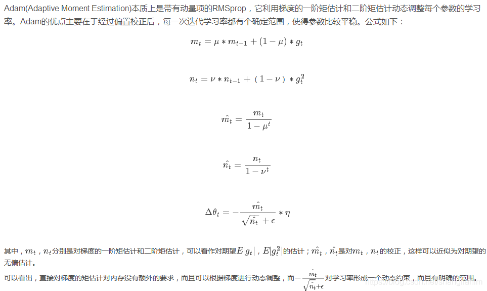
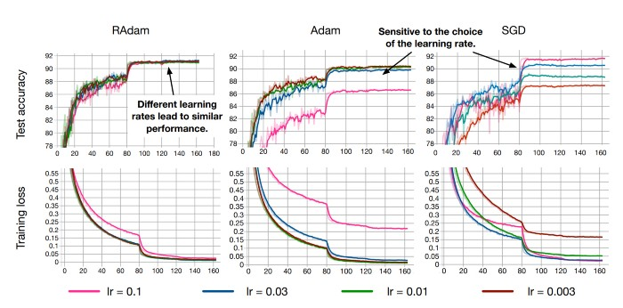
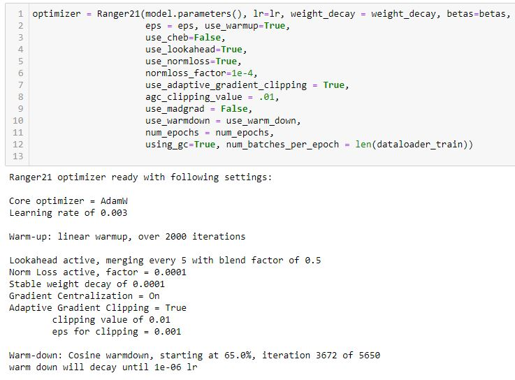

# SGD
> SGD就是每一次迭代计算mini-batch的梯度，然后对参数进行更新，是最常见的优化方法了。即：<br/>
> <br/>
> 其中，η ηη是学习率，g t g_{t}g t是梯度 <br/>
> params (iterable) – 待优化参数的iterable或者是定义了参数组的dict <br/>
> lr (float) – 学习率<br/>
> momentum (float, 可选) – 动量因子（默认：0）<br/>
> weight_decay (float, 可选) – 权重衰减（L2惩罚）（默认：0）<br/>
> dampening (float, 可选) – 动量的抑制因子（默认：0）<br/>
> nesterov (bool, 可选) – 使用Nesterov动量（默认：False）<br/>
> 可实现 SGD 优化算法，带动量 SGD 优化算法，带 NAG(Nesterov accelerated
gradient)动量 SGD 优化算法,并且均可拥有 weight_decay 项。<br/>
> **优缺点**：<br/>
SGD完全依赖于当前batch的梯度，所以ηη可理解为允许当前batch的梯度多大程度影响参数更新。对所有的参数更新使用同样的learning rate，选择合适的learning rate比较困难，容易收敛到局部最优。
## code
```python
import torch
optimizer = torch.optim.SGD(params, lr=0.001, momentum=0, dampening=0, weight_decay=0, nesterov=False)
```

# ASGD(平均随机梯度下降算法)
> ASGD 就是用空间换时间的一种 SGD。<br/>
> params (iterable) – 待优化参数的iterable或者是定义了参数组的dict <br/>
> lr (float, 可选) – 学习率（默认：1e-2）<br/>
> lambd (float, 可选) – 衰减项（默认：1e-4）<br/>
> alpha (float, 可选) – eta更新的指数（默认：0.75）<br/>
> t0 (float, 可选) – 指明在哪一次开始平均化（默认：1e6）<br/>
> weight_decay (float, 可选) – 权重衰减（L2惩罚）（默认: 0）
## code
```python
import torch
torch.optim.ASGD(params, lr=0.01, lambd=0.0001, alpha=0.75, t0=1000000.0, weight_decay=0)
```

# Adagrad
> AdaGrad算法就是将每一个参数的每一次迭代的梯度取平方累加后在开方，用全局学习率除以这个数，作为学习率的动态更新。<br/>
>  <br/>
> 其中，r rr为梯度累积变量，r rr的初始值为0。ε εε为全局学习率，需要自己设置。δ δδ为小常数，为了数值稳定大约设置为1 0 − 7 10^{-7}10 −7。<br/>
> params (iterable) – 待优化参数的iterable或者是定义了参数组的dict <br/>
lr (float, 可选) – 学习率（默认: 1e-2）<br/>
lr_decay (float, 可选) – 学习率衰减（默认: 0）<br/>
weight_decay (float, 可选) – 权重衰减（L2惩罚）（默认: 0）<br/>
> **优缺点**：<br/>
Adagrad 是一种自适应优化方法，是自适应的为各个参数分配不同的学习率。
>这个学习率的变化，会受到梯度的大小和迭代次数的影响。梯度越大，学习率越小；梯度越小，
>学习率越大。缺点是训练后期，学习率过小，因为 Adagrad 累加之前所有的梯度平方作为分母。
>随着算法不断迭代，r会越来越大，整体的学习率会越来越小。所以，一般来说AdaGrad算法一开始是激励收敛，
>到了后面就慢慢变成惩罚收敛，速度越来越慢。
## code
```python
import torch
optimizer = torch.optim.Adagrad(params, lr=0.01, lr_decay=0, weight_decay=0)
```

# adadelta(自适应学习率调整)
> Adadelta是对Adagrad的扩展，但是进行了计算上的简化。<br/>
Adagrad会累加之前所有的梯度平方，而Adadelta只累加固定大小的项，并且也不直接存储这些项，仅仅是近似计算对应的平均值。<br/>
> params (iterable) – 待优化参数的iterable或者是定义了参数组的dict<br/>
rho (float, 可选) – 用于计算平方梯度的运行平均值的系数（默认：0.9）<br/>
eps (float, 可选) – 为了增加数值计算的稳定性而加到分母里的项（默认：1e-6）<br/>
lr (float, 可选) – 在delta被应用到参数更新之前对它缩放的系数（默认：1.0）<br/>
weight_decay (float, 可选) – 权重衰减（L2惩罚）（默认: 0）<br/>
> **优缺点**：<br/>
Adadelta已经不依赖于全局学习率。训练初中期，加速效果不错，很快，训练后期，反复在局部最小值附近抖动。
## code
```python
import torch
optimizer = torch.optim.Adadelta(params, lr=1.0, rho=0.9, eps=1e-06, weight_decay=0)
```

# rmsprop
> RMSprop 和 Adadelta 一样，也是对 Adagrad 的一种改进。 RMSprop 采用均方根作为分<br/>
母，可缓解 Adagrad 学习率下降较快的问题， 并且引入均方根，可以减少摆动。<br/>
> params (iterable) – 待优化参数的iterable或者是定义了参数组的dict<br/>
lr (float, 可选) – 学习率（默认：1e-2）<br/>
momentum (float, 可选) – 动量因子（默认：0）<br/>
alpha (float, 可选) – 平滑常数（默认：0.99）<br/>
eps (float, 可选) – 为了增加数值计算的稳定性而加到分母里的项（默认：1e-8）<br/>
centered (bool, 可选) – 如果为True，计算中心化的RMSProp，并且用它的方差预测值对梯度进行归一化<br/>
weight_decay (float, 可选) – 权重衰减（L2惩罚）（默认: 0）<br/>
## code
```python
import torch
optimizer = torch.optim.RMSprop(params, lr=0.01, alpha=0.99, eps=1e-08, weight_decay=0, momentum=0, centered=False)
```

# Adam(自适应矩估计)
>  <br/>
> params (iterable) – 待优化参数的iterable或者是定义了参数组的dict<br/>
lr (float, 可选) – 学习率（默认：1e-3）<br/>
betas (Tuple[float, float], 可选) – 用于计算梯度以及梯度平方的运行平均值的系数（默认：0.9，0.999）<br/>
eps (float, 可选) – 为了增加数值计算的稳定性而加到分母里的项（默认：1e-8）<br/>
weight_decay (float, 可选) – 权重衰减（L2惩罚）（默认: 0）<br/>
>**优缺点**：<br/>
Adam的优点主要在于经过偏置校正后，每一次迭代学习率都有个确定范围，使得参数比较平稳。<br/>
Adam结合了Adagrad善于处理稀疏梯度和RMSprop善于处理非平稳目标的优点。
## code
```python
import torch
optimizer = torch.optim.Adam(params, lr=0.001, betas=(0.9, 0.999), eps=1e-08, weight_decay=0, amsgrad=False)
```

# Adamax
> Adamax 是对 Adam 增加了一个学习率上限的概念，所以也称之为 Adamax。
> params (iterable) – 待优化参数的iterable或者是定义了参数组的dict<br/>
lr (float, 可选) – 学习率（默认：2e-3）<br/>
betas (Tuple[float, float], 可选) – 用于计算梯度以及梯度平方的运行平均值的系数<br/>
eps (float, 可选) – 为了增加数值计算的稳定性而加到分母里的项（默认：1e-8）<br/>
weight_decay (float, 可选) – 权重衰减（L2惩罚）（默认: 0）<br/>
> **优缺点**：<br/>
Adamax是Adam的一种变体，此方法对学习率的上限提供了一个更简单的范围。
Adamax学习率的边界范围更简单。
## code
```python
import torch
optimizer = torch.optim.Adamax(params, lr=0.002, betas=(0.9, 0.999), eps=1e-08, weight_decay=0)
```

# SparseAdam
> 针对稀疏张量的一种“阉割版”Adam 优化方法。<br/>
> params (iterable) – 待优化参数的iterable或者是定义了参数组的dict<br/>
lr (float, 可选) – 学习率（默认：2e-3）<br/>
betas (Tuple[float, float], 可选) – 用于计算梯度以及梯度平方的运行平均值的系数<br/>
eps (float, 可选) – 为了增加数值计算的稳定性而加到分母里的项（默认：1e-8）<br/>
## code
```python
import torch
optimizer = torch.optim.SparseAdam(params, lr=0.001, betas=(0.9, 0.999), eps=1e-08)
```

# L-BFGS
> L-BFGS 属于拟牛顿算法。 L-BFGS 是对 BFGS 的改进，特点就是节省内存。<br/>
>lr (float) – 学习率（默认：1）<br/>
max_iter (int) – 每一步优化的最大迭代次数（默认：20）)<br/>
max_eval (int) – 每一步优化的最大函数评价次数（默认：max * 1.25）<br/>
tolerance_grad (float) – 一阶最优的终止容忍度（默认：1e-5）<br/>
tolerance_change (float) – 在函数值/参数变化量上的终止容忍度（默认：1e-9）<br/>
history_size (int) – 更新历史的大小（默认：100）<br/>
## code
```python
import torch
optimizer = torch.optim.LBFGS(params, lr=1, max_iter=20, max_eval=None, tolerance_grad=1e-05, tolerance_change=1e-09, history_size=100, line_search_fn=None)
```

# Rprop(弹性反向传播算法)
> 该优化方法适用于 full-batch，不适用于 mini-batch。不推荐。
>params (iterable) – 待优化参数的iterable或者是定义了参数组的dict<br/>
lr (float, 可选) – 学习率（默认：1e-2）<br/>
etas (Tuple[float, float], 可选) – 一对（etaminus，etaplis）, 它们分别是乘法的增加和减小的因子（默认：0.5，1.2）<br/>
step_sizes (Tuple[float, float], 可选) – 允许的一对最小和最大的步长（默认：1e-6，50）<br/>
## code
```python
import torch
optimizer = torch.optim.Rprop(params, lr=0.01, etas=(0.5, 1.2), step_sizes=(1e-06, 50))
```

# adamw
## code
```python
import torch
optimizer = torch.optim.AdamW(params, lr=0.001, betas=(0.9, 0.999), eps=1e-08, weight_decay=0.01, amsgrad=False)
```

# Lookahead
## [paper](https://arxiv.org/abs/1907.08610)

# [radam](RAdam.py)
## [paper](https://arxiv.org/abs/1908.03265)
> [作者源码](https://github.com/LiyuanLucasLiu/RAdam)
> [讲解参考](https://lessw.medium.com/new-state-of-the-art-ai-optimizer-rectified-adam-radam-5d854730807b)
> 
## code
```python
import torch
from .RAdam import RAdam
optimizer = RAdam(filter(lambda p: p.requires_grad, model.parameters()), lr=0.01, betas=(0.90, 0.999), eps=1e-08, weight_decay=1e-4)
```

# [ranger](Ranger.py)
> 将最新的LookAhead和RAdam优化器结合，产生了一个新的算法ranger
> [代码](https://github.com/lessw2020/Ranger-Deep-Learning-Optimizer)
> [代码2](https://github.com/lessw2020/Ranger21)
> [本地代码](Ranger21)<br/>
> 
> [本地代码2](Ranger.py)
## code
```python
import torch
from .Ranger import Ranger
optimizer = Ranger(filter(lambda p: p.requires_grad, model.parameters()), lr=0.01, betas=(0.95, 0.999), eps=1e-08, weight_decay=1e-4)
```

# LARS
> [介绍](https://www.jianshu.com/p/e430620d3acf)
> 将最新的LookAhead和RAdam优化器结合，产生了一个新的算法——Ranger，获得了比单独使用RAdam要好的效果。
> 后来有人将LARS与Ranger结合，效果取得了进一步[提升](https://github.com/mgrankin/over9000)。
> 最近，Ranger的提出者又将[GC](https://arxiv.org/abs/2004.01461) (Gradient Centralization)方法与Ranger结合，
> [也取得了比Ranger好的效果](https://github.com/lessw2020/Ranger-Deep-Learning-Optimizer)。
> 这里我会分四篇文章分享在阅读这四个方法的论文时我个人的总结和体会。
> 由于LookAhead优化器与SWA比较相似，所以还会开辟一篇文章介绍SWA和[Fast SWA](https://arxiv.org/abs/1806.05594)优化器。本篇文章为该系列文章第一篇。
## [paper](https://arxiv.org/abs/1708.03888)
## [code](https://github.com/kakaobrain/torchlars)
> [本地代码](torchlars)

------------------------------------------------
# [utils](utils.py)
<table>
    <thead>
        <tr><th>名称</th><th>功能</th></tr>
    </thead>
    <tbody>
        <tr><td>get_current_lr</td><td>获取当前lr</td></tr>
    </tbody>
</table>

# 参考链接
1. https://www.zhihu.com/question/340834465