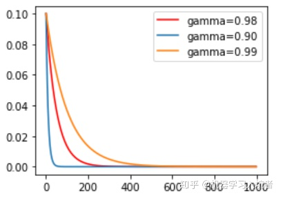
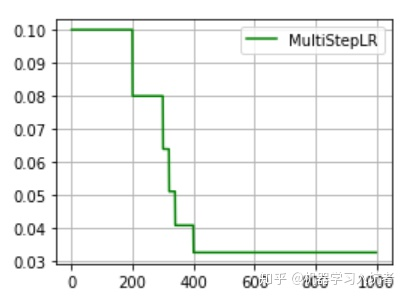
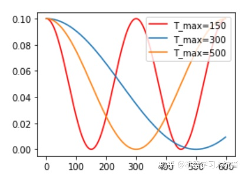
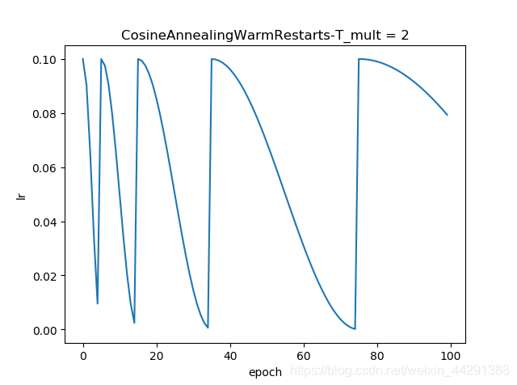
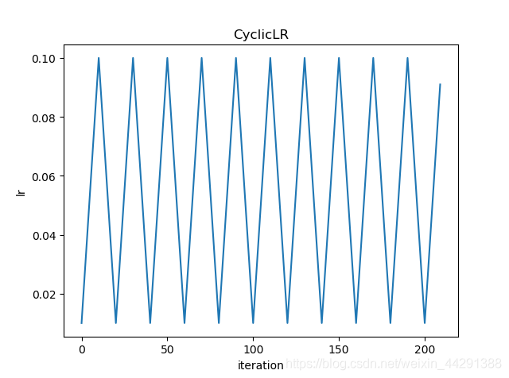
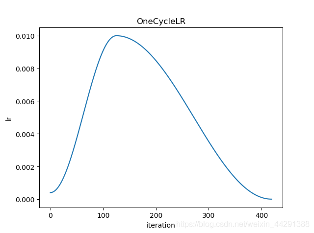

# ExpLR指数衰减
> 学习率按照指数的形式衰减是比较常用的策略，
> 我们首先需要确定需要针对哪个优化器执行学习率动态调整策略，
> 其中参数gamma表示衰减的底数，选择不同的gamma值可以获得幅度不同的衰减曲线
> 
## code 
```python
optimizer_ExpLR = torch.optim.SGD(net.parameters(), lr=0.1)
ExpLR = torch.optim.lr_scheduler.ExponentialLR(optimizer_ExpLR, gamma=0.98)
```

# StepLR 固定步长衰减
> 有时我们希望学习率每隔一定步数（或者epoch）就减少为原来的gamma分之一，使用固定步长衰减依旧先定义优化器
> 其中gamma参数表示衰减的程度，step_size参数表示每隔多少个step进行一次学习率调整
> 
## code 
```python
optimizer_StepLR = torch.optim.SGD(net.parameters(), lr=0.1)
StepLR = torch.optim.lr_scheduler.StepLR(optimizer_StepLR, step_size=step_size, gamma=0.65)
```

# MultiStepLR 多步长衰减
> 上述固定步长的衰减的虽然能够按照固定的区间长度进行学习率更新，
> 但是有时我们希望不同的区间采用不同的更新频率，或者是有的区间更新学习率，
> 有的区间不更新学习率，这就需要使用MultiStepLR来实现动态区间长度控制：
> 其中milestones参数为表示学习率更新的起止区间，在区间[0. 200]内学习率不更新，
> 而在[200, 300]、[300, 320].....[340, 400]的右侧值都进行一次更新；
> gamma参数表示学习率衰减为上次的gamma分之一。
> 
## code 
```python
optimizer_MultiStepLR = torch.optim.SGD(net.parameters(), lr=0.1)
torch.optim.lr_scheduler.MultiStepLR(optimizer_MultiStepLR,
                    milestones=[200, 300, 320, 340, 200], gamma=0.8)
```

# CosineLR 余弦退火衰减
> 余弦退火策略不应该算是学习率衰减策略，因为它使得学习率按照周期变化
> 其包含的参数和余弦知识一致，参数T_max表示余弦函数周期；
> eta_min表示学习率的最小值，默认它是0表示学习率至少为正值。
> 确定一个余弦函数需要知道最值和周期，其中周期就是T_max，最值是初试学习率。
> 下图展示了不同周期下的余弦学习率更新曲线：
> 
> [demo](../../../test/test_CosineAnnealingLR.py)
## code 
```python
optimizer_CosineLR = torch.optim.SGD(net.parameters(), lr=0.1)
CosineLR = torch.optim.lr_scheduler.CosineAnnealingLR(optimizer_CosineLR, T_max=150, eta_min=0)
```

# LambdaLR

# ReduceLROnPlateau 根据测试指标
> 当参考的评价指标停止改进时,降低学习率,factor为每次下降的比例,训练过程中,当指标连续patience次数还没有改进时,降低学习率;
> 1. optimer指的是网络的优化器
> 2. mode (str) ，可选择‘min’或者‘max’，min表示当监控量停止下降的时候，学习率将减小，max表示当监控量停止上升的时候，学习率将减小。默认值为‘min’
> 3. factor 学习率每次降低多少，new_lr = old_lr * factor
> 4. patience=10，容忍网路的性能不提升的次数，高于这个次数就降低学习率
> 5. verbose（bool） - 如果为True，则为每次更新向stdout输出一条消息。 默认值：False
> 6. threshold（float） - 测量新最佳值的阈值，仅关注重大变化。 默认值：1e-4
> 7. cooldown： 减少lr后恢复正常操作之前要等待的时期数。 默认值：0。
> 8. min_lr,学习率的下限
> 9. eps ，适用于lr的最小衰减。 如果新旧lr之间的差异小于eps，则忽略更新。 默认值：1e-8。
## code 
```python
torch.optim.lr_scheduler.ReduceLROnPlateau(optimizer, mode='min', factor=0.1, patience=10, verbose=False, threshold=0.0001, threshold_mode='rel', cooldown=0, min_lr=0, eps=1e-08)
```

# CosineAnnealingWarmRestarts
> 
> 
## code
```python
scheduler = torch.optim.lr_scheduler.CosineAnnealingWarmRestarts(optimizer, T_0=5, T_mult=1)
```

# CyclicLR
> 
## code
```python
torch.optim.lr_scheduler.CyclicLR(optimizer, base_lr, max_lr, step_size_up=2000, step_size_down=None, mode=‘triangular’, gamma=1.0, scale_fn=None, scale_mode=‘cycle’, cycle_momentum=True, base_momentum=0.8, max_momentum=0.9, last_epoch=-1, verbose=False)
```

# OneCycleLR
> 
## code
```python
epochs = 20
scheduler = torch.optim.lr_scheduler.OneCycleLR(optimizer, max_lr=0.01,
                                                    steps_per_epoch=len(data_loader), epochs=epochs)
```

# PolyLR
> [demo](../../../test/test_PolyLR.py)
## [code](poly_lr.py)
